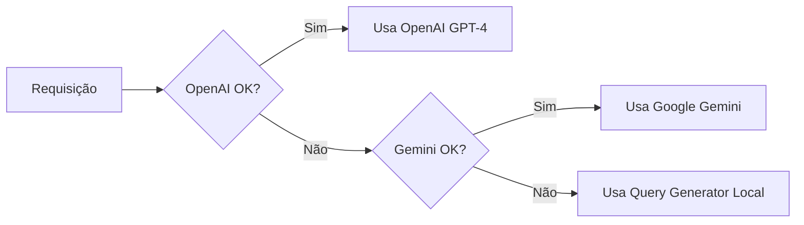

# 🤖 Configuração das IAs - Wiser IA Assistant

## 📊 Status Atual

| Serviço | Status | Prioridade | Observação |
|---------|--------|------------|------------|
| **OpenAI GPT-4** | ✅ Testado e Funcional | 1ª (Principal) | Melhor qualidade de resposta |
| **Google Gemini** | ⚠️ Aguardando Config | 2ª (Fallback) | Usado quando OpenAI falha |
| **Query Generator** | ✅ Sempre Ativo | 3ª (Backup) | Sempre disponível localmente |

## 🔧 Como Configurar

### 1. Desenvolvimento Local (.dev.vars)

Crie ou edite o arquivo `.dev.vars` na raiz do projeto:

```env
# OpenAI (Prioridade 1)
OPENAI_API_KEY=sk-proj-sua-chave-aqui

# Google Gemini (Prioridade 2 - Fallback)
GOOGLE_API_KEY=AIza-sua-chave-aqui

# Supabase (Banco de Dados)
SUPABASE_URL=https://seu-projeto.supabase.co
SUPABASE_ANON_KEY=sua-chave-supabase
```

### 2. Produção - Cloudflare Pages

Configure as variáveis de ambiente:

```bash
# OpenAI
npx wrangler pages secret put OPENAI_API_KEY --project-name wiser-ia

# Google Gemini
npx wrangler pages secret put GOOGLE_API_KEY --project-name wiser-ia

# Supabase
npx wrangler pages secret put SUPABASE_URL --project-name wiser-ia
npx wrangler pages secret put SUPABASE_ANON_KEY --project-name wiser-ia
```

### 3. Produção - Vercel (Alternativa)

No dashboard do Vercel:
1. Settings → Environment Variables
2. Adicione cada variável listada acima
3. Faça redeploy

## 🔑 Obter API Keys

### OpenAI
1. Acesse: https://platform.openai.com/api-keys
2. Clique em "Create new secret key"
3. Copie a chave (formato: `sk-proj-...`)

### Google Gemini
1. Acesse: https://makersuite.google.com/app/apikey
2. Clique em "Create API Key"
3. Copie a chave (formato: `AIza...`)

### Supabase
1. Acesse seu projeto no Supabase
2. Settings → API
3. Copie a URL e a chave anon

## 🔄 Sistema de Fallback



## 📈 Comparação das IAs

| Aspecto | OpenAI GPT-4 | Google Gemini | Query Generator |
|---------|--------------|---------------|-----------------|
| **Qualidade** | Excelente | Muito Boa | Básica |
| **Velocidade** | 4-8s | 2-4s | <200ms |
| **Custo** | $$$ | $$ | Grátis |
| **Contexto** | 128k tokens | 32k tokens | Limitado |
| **Idiomas** | Todos | Todos | Português |

## 🧪 Testar Configuração

### 1. Verificar Status das IAs
```bash
curl http://localhost:3000/api/ai-status
```

### 2. Testar Query
```bash
curl -X POST http://localhost:3000/api/chat-smart \
  -H "Content-Type: application/json" \
  -d '{"message": "Teste", "sessionId": "test"}'
```

### 3. Verificar Qual IA Respondeu
A resposta incluirá o campo `aiModel` indicando:
- `gpt-4` - OpenAI está respondendo
- `gemini-1.5-flash` - Google Gemini está respondendo
- `local` - Query Generator local está respondendo

## 🎯 Indicadores na Interface

A interface mostra visualmente qual IA está ativa:
- 🧠 Badge verde = OpenAI GPT-4
- ✨ Badge roxo = Google Gemini
- 🔧 Badge cinza = Query Generator Local

## ⚠️ Segurança

**IMPORTANTE**: 
- NUNCA commite API keys no código
- SEMPRE use variáveis de ambiente
- Mantenha `.dev.vars` no `.gitignore`
- Rotacione keys regularmente
- Configure limites de uso nas plataformas

## 📝 Logs e Debug

Para verificar qual IA está sendo usada:

```bash
# Ver logs do servidor
pm2 logs wiser-ia --lines 50

# Verificar configuração
cat .dev.vars | grep -E "OPENAI|GOOGLE"

# Status das IAs
curl http://localhost:3000/api/ai-status | jq
```

## ✅ Checklist de Configuração

- [ ] OpenAI API key configurada
- [ ] Google API key configurada (opcional)
- [ ] Supabase configurado
- [ ] `.dev.vars` criado (desenvolvimento)
- [ ] Secrets configurados (produção)
- [ ] Testado com `/api/ai-status`
- [ ] Interface mostrando indicadores
- [ ] Fallback funcionando

## 🚀 Deploy

Após configurar as API keys:

```bash
# Build
npm run build

# Deploy para Cloudflare Pages
npx wrangler pages deploy dist --project-name wiser-ia

# Ou commit e push para GitHub (deploy automático)
git add .
git commit -m "feat: Configure AI services"
git push origin main
```

## 📞 Suporte

Em caso de problemas:
1. Verifique `/api/ai-status`
2. Consulte os logs com `pm2 logs`
3. Teste cada IA individualmente
4. Verifique as API keys