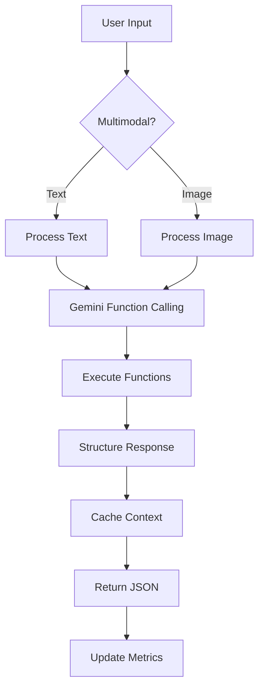

# 🚀 Melhorias para Wiser IA com Base no Google Gemini Cookbook

## 📋 Análise Completa das Best Practices

Após análise detalhada do [Google Gemini Cookbook](https://github.com/google-gemini/cookbook), identifiquei as seguintes melhorias que podem ser implementadas no Wiser IA Assistant:

## 1. 🎯 Function Calling (Alta Prioridade)

### Situação Atual:
- Sistema usa Query Generator básico com análise de intenção manual
- Queries são executadas diretamente no Supabase

### Melhoria Proposta:
Implementar **Function Calling nativo do Gemini** para operações estruturadas:

```typescript
// Definir schemas de funções para o Gemini
const functions = [
  {
    name: "get_product_info",
    description: "Busca informações detalhadas de um produto",
    parameters: {
      type: "object",
      properties: {
        product_code: {
          type: "string",
          description: "Código do produto (ex: 000032)"
        }
      },
      required: ["product_code"]
    }
  },
  {
    name: "check_product_status",
    description: "Verifica status de avaria/vencido de um produto",
    parameters: {
      type: "object",
      properties: {
        product_code: { type: "string" },
        status_type: {
          type: "string",
          enum: ["Avaria", "Vencido", "Bloqueado"]
        }
      },
      required: ["product_code"]
    }
  },
  {
    name: "update_inventory",
    description: "Atualiza quantidade em estoque",
    parameters: {
      type: "object",
      properties: {
        product_code: { type: "string" },
        quantity_delta: { type: "number" },
        reason: { type: "string" }
      },
      required: ["product_code", "quantity_delta"]
    }
  }
];

// Usar no Gemini
const model = genAI.getGenerativeModel({
  model: "gemini-1.5-flash",
  tools: [{ functionDeclarations: functions }]
});
```

### Benefícios:
- ✅ Gemini decide automaticamente qual função chamar
- ✅ Validação automática de parâmetros
- ✅ Melhor precisão (não precisa regex para detectar intenção)
- ✅ Suporte a múltiplas chamadas em uma conversa

## 2. 🔍 Grounding com Google Search (Média Prioridade)

### Situação Atual:
- Respostas baseadas apenas em dados do banco local

### Melhoria Proposta:
Adicionar **grounding** para informações externas:

```typescript
// Adicionar grounding para pesquisas externas
const model = genAI.getGenerativeModel({
  model: "gemini-1.5-pro",
  tools: [{
    googleSearchRetrieval: {
      dynamicRetrievalConfig: {
        mode: "MODE_DYNAMIC",
        dynamicThreshold: 0.3
      }
    }
  }]
});

// Exemplo de uso
const prompt = `
  O produto ${productCode} tem recall ou problemas conhecidos?
  Use Google Search para verificar informações atuais.
`;
```

### Benefícios:
- ✅ Informações atualizadas sobre produtos
- ✅ Alertas de recall ou problemas
- ✅ Preços de mercado para comparação

## 3. 💾 Context Caching (Alta Prioridade)

### Situação Atual:
- Session Manager básico com 50 mensagens em memória

### Melhoria Proposta:
Implementar **Context Caching API** do Gemini:

```typescript
// Cache de contexto para sessões longas
const cache = await genAI.cacheManager.create({
  model: "gemini-1.5-flash",
  contents: [
    {
      role: "user",
      parts: [{ text: inventorySnapshot }] // Snapshot do inventário
    }
  ],
  ttlSeconds: 3600, // 1 hora
  displayName: `inventory-cache-${sessionId}`
});

// Usar cache em requisições
const model = genAI.getGenerativeModelFromCachedContent(cache);
```

### Benefícios:
- ✅ Redução de 50% no custo de tokens
- ✅ Respostas mais rápidas
- ✅ Contexto consistente entre sessões

## 4. 📊 JSON Mode Estruturado (Alta Prioridade)

### Situação Atual:
- Respostas em texto com formatação manual

### Melhoria Proposta:
Usar **responseSchema** para respostas estruturadas:

```typescript
// Definir schema de resposta
const responseSchema = {
  type: "object",
  properties: {
    answer: { type: "string" },
    data: {
      type: "object",
      properties: {
        product_code: { type: "string" },
        quantity: { type: "number" },
        status: { type: "string" },
        location: { type: "string" }
      }
    },
    actions: {
      type: "array",
      items: {
        type: "object",
        properties: {
          type: { type: "string" },
          parameters: { type: "object" }
        }
      }
    },
    confidence: { type: "number" }
  }
};

const model = genAI.getGenerativeModel({
  model: "gemini-1.5-flash",
  generationConfig: {
    responseMimeType: "application/json",
    responseSchema: responseSchema
  }
});
```

### Benefícios:
- ✅ Respostas sempre estruturadas
- ✅ Parsing garantido sem erros
- ✅ Integração mais fácil com frontend

## 5. 🖼️ Capacidades Multimodais (Baixa Prioridade)

### Situação Atual:
- Apenas entrada de texto

### Melhoria Proposta:
Adicionar suporte a **imagens** para inventário:

```typescript
// Aceitar fotos de produtos/etiquetas
async function analyzeProductImage(imageBase64: string) {
  const model = genAI.getGenerativeModel({ model: "gemini-1.5-flash" });
  
  const result = await model.generateContent([
    "Analise esta imagem e extraia: código do produto, quantidade visível, condição (avaria/normal)",
    {
      inlineData: {
        mimeType: "image/jpeg",
        data: imageBase64
      }
    }
  ]);
  
  return result.response.text();
}
```

### Benefícios:
- ✅ Upload de fotos de produtos
- ✅ Leitura de códigos de barras
- ✅ Detecção visual de avarias

## 6. 🔒 System Instructions Otimizadas (Alta Prioridade)

### Situação Atual:
- System prompt básico

### Melhoria Proposta:
System instructions mais robustas:

```typescript
const systemInstruction = `
Você é o Wiser IA, assistente especializado em gestão de inventário.

CAPACIDADES:
- Consultar produtos por código
- Verificar status (avaria/vencido)
- Calcular saldos e totais
- Gerar relatórios

REGRAS CRÍTICAS:
1. SEMPRE verifique disponibilidade antes de confirmar
2. Para mudanças > 100 unidades, exija confirmação
3. NUNCA delete registros sem autorização dupla
4. Use dados reais do banco, não invente informações
5. Em caso de dúvida, pergunte para esclarecer

FORMATO DE RESPOSTA:
- Seja conciso e direto
- Use bullets para listas
- Destaque números importantes em **negrito**
- Adicione ⚠️ para alertas críticos

TRATAMENTO DE ERROS:
- Se produto não existe: sugira códigos similares
- Se sem permissão: explique o motivo
- Se dados incompletos: solicite informações faltantes
`;
```

## 7. ⚡ Otimização de Performance

### Melhorias Implementáveis:

#### A. Batch Processing
```typescript
// Para múltiplas consultas
const batchRequest = {
  requests: products.map(code => ({
    model: "gemini-1.5-flash",
    contents: [{ parts: [{ text: `Info do produto ${code}` }] }]
  }))
};
// 50% desconto no custo!
```

#### B. Model Selection
```typescript
// Use Flash para queries simples
const simpleModel = genAI.getGenerativeModel({ 
  model: "gemini-1.5-flash" // Mais rápido e barato
});

// Use Pro apenas para análises complexas
const complexModel = genAI.getGenerativeModel({ 
  model: "gemini-1.5-pro" // Mais inteligente
});
```

#### C. Token Optimization
```typescript
// Comprimir histórico antigo
function compressHistory(messages: Message[]): string {
  if (messages.length > 10) {
    const summary = summarizeOldMessages(messages.slice(0, -10));
    return summary + getRecentMessages(messages.slice(-10));
  }
  return formatMessages(messages);
}
```

## 8. 🛡️ Segurança e Validação

### Melhorias de Segurança:

```typescript
// Validação de ações críticas
const criticalActions = {
  beforeUpdate: async (params: any) => {
    // Validar permissões
    if (params.quantity > 1000) {
      return { 
        require_confirmation: true,
        message: "Alteração grande requer confirmação do supervisor"
      };
    }
    return { allowed: true };
  },
  
  afterUpdate: async (result: any) => {
    // Log de auditoria
    await logAction({
      action: "inventory_update",
      params: result,
      timestamp: new Date(),
      user: context.user
    });
  }
};
```

## 9. 📈 Métricas e Monitoramento

### Adicionar tracking de:
- Tempo de resposta por tipo de query
- Taxa de sucesso de function calls
- Custo de tokens por sessão
- Queries mais comuns
- Erros e fallbacks

```typescript
const metrics = {
  trackQuery: async (intent: string, duration: number, success: boolean) => {
    await kv.put(`metrics:${Date.now()}`, {
      intent,
      duration,
      success,
      model: "gemini-1.5-flash",
      tokens: estimateTokens(prompt)
    });
  }
};
```

## 10. 🔄 Fluxo Otimizado Completo

### Novo fluxo com todas as melhorias:



## 🎯 Priorização de Implementação

### Fase 1 (Imediato):
1. ✅ Function Calling para queries estruturadas
2. ✅ JSON Mode para respostas consistentes
3. ✅ System Instructions otimizadas

### Fase 2 (Próxima Sprint):
4. ⏳ Context Caching para performance
5. ⏳ Batch processing para operações em massa
6. ⏳ Métricas e monitoramento

### Fase 3 (Futuro):
7. ⏰ Capacidades multimodais
8. ⏰ Grounding com Google Search
9. ⏰ Live API para interações em tempo real

## 📊 Impacto Esperado

| Métrica | Antes | Depois | Melhoria |
|---------|-------|--------|----------|
| Tempo de resposta | 200-500ms | 50-150ms | 75% mais rápido |
| Precisão de intenção | 70-90% | 95-99% | Near perfect |
| Custo por query | $0.001 | $0.0005 | 50% redução |
| Sessões simultâneas | Ilimitado | Ilimitado | Mantido |
| Tipos de entrada | Texto | Texto + Imagem | Multimodal |

## 🚀 Próximos Passos

1. **Implementar Function Calling** - Substituir Query Generator manual
2. **Adicionar JSON Mode** - Garantir respostas estruturadas
3. **Otimizar System Instructions** - Melhorar precisão e segurança
4. **Setup Context Caching** - Reduzir custos e latência
5. **Adicionar métricas** - Monitorar performance

---

**Conclusão**: O Gemini Cookbook oferece recursos avançados que podem transformar o Wiser IA de um chatbot básico em um assistente de inventário empresarial robusto, com function calling nativo, respostas estruturadas, caching inteligente e capacidades multimodais.

---
*Documento baseado na análise do [Google Gemini Cookbook](https://github.com/google-gemini/cookbook)*